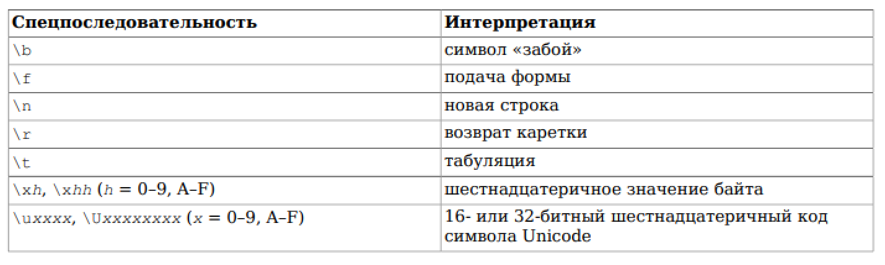

## Синтаксис языка SQL (диалект Postgres)

### Базовые понятия

- Любая SQL программа состоит из последовательности комманд, которые разделены знаком `;`

- Команда состоит из последовательности компонентов, которые могут быть разделены пробелом, табуляцией или переносом на новую строку

- Виды компонентов команды:
    - Ключевые слова *(SELECT, INSERT, IN и т.д.)*

    - Идентификаторы
        - Обычные *(test_value, a, qwe)*

        - В кавычках *("foo", "TeSt_vAlUe")*

    - Специальные символы

    - Константы

    - Операторы

    - Комментарии однострочные и многострочные

<br>

Пример простой SQL-программы:
```sql
SELECT * FROM test_table;
UPDATE test_table SET test_value = 5;
INSERT INTO test_table VALUES (11, 'Lorem ipsum');
```

<br>

### Особенности ключевых слов и идентификаторов

- Идентификаторы должны начинаться с `латинской буквы` или знака `_`. Последующими символами могут быть: буквы, цифры, знак _.

- Стандарт SQL гласит:
    - Знаки доллара `$` нельзя использовать в идентификаторах, чтобы не нарушить переносимость приложения

    - В рамках языка не будет ключевых слов, которые начинают или заканчиваются на `цифру` или знак `_`. Это сделано для их защиты от конфликтов с расширением стандарта

- Система выделяет 63 байта для имени идентификатора. Более длинные имена урезаются. Это ограничение задано в константе `NAMEDATALEN` в файле `src/include/pg_config_manual.h`

- Ключевые слова и идентификаторы воспринимаются системой БЕЗ учета регистра. Следующие команды являются идентичными:
    ```sql
    UPDATE test_table SET test_value = 5;
    ```
    ```sql
    upDATE TeSt_TaBlE set TEST_VALUE = 5;
    ```

- Неформальное соглашение SQL гласит:
    - Имена ключевых слов мы пишем заглавными буквами

    - Имена идентификаторов мы пишем строчными буквами

    - Либо все идентификаторы мы пишем `БЕЗ кавычек`, либо все идентификаторы мы пишем `С кавычками`

- Идентификатор с кавычками считается регистрозависимым

- Также в идентификаторах можно использовать Unicode символы:
    - Перед началом идентификатора ставим символ `U&`
    - Сам идентификатор оборачиваем в кавычки
    - Символ Unicode можно написать либо с символом `\` и 4 шестнадцатеричными цифрами, либо с символами `\+` и 6 шестнадцатеричными цифрами

        Пример: `U&"Lorem ipsum \0441 \043B"`

<br>

### Особенности констант

- Виды констант:
    - Строковые:
        - Со спецпоследовательностями в стиле языка Си
        - Со спецпоследовательностями Unicode
        - Заключенные в доллар
    - Целочисленные
    - Вещественные
    - Иные

<br>

`Обычная строковая константа`

- Строковая константа - это последовательность символов, заключенная в апострофы

- Если строка должна содержать знак апострофа `'`, мы должны его продублировать. Пример: `'Жанна д''Арк'`

- Две строки, которые разделены пробелом или минимум одним знаком переноса на новую строку считается за одну строку. Пример идентичных программ:
    ```sql
    SELECT 'foo' 'bar';
    ```
    ```sql
    SELECT 'foo' 
    'bar';
    ```

`Строковая константа с спецпоследовательностями`

- Строковая константа с Сишными спецпоследовательностями должна иметь перед апострофом знак `E`. Пример такой строки: `E'Lorem\nIpsum\\'`

- Таблица Сишных спецпоследовательностей:

    

- Если мы хотим использовать знак `\` в строке, то мы должны его экранировать таким же знаком

`Строковая константа в формате Unicode`

- Строковая константа в формате Unicode должна придерживаться таких же привил, что и имена идентификаторов в формате Unicode

`Долларовая строковая константа`

- Используется для того, чтобы избежать чрезмерного дублирования знака апострофа `'` или для вставки одной строковой константы в другую. Этот вид констант часто используется в процедурных функциях

- Чтобы использовать долларовую константу, нужно обычный текст выделить в подпоследовательности вида: `$tag$` с обоих сторон

- Пример обычной и долларовой константы
    ```sql
    'Жанна д''Арк'
    ```
    ```sql
    $tag$Жанна д'Арк$tag$
    ```

- Пример процедурной функции:
    ```sql
    $function$
    BEGIN
        RETURN ($1 ~ $q$Lorem ipsum$q$)'
    END;
    $function$
    ```
<br>

`Числовые константы`

- Все числовые константы должны иметь следующий вид:
    - цифры
    - цифры.[цифры][e[+-]цифры]
    - [цифры].цифры[e[+-]цифры]
    - цифр[+-]цифры

- Любой знак `+` или `-` перед числом считается оператором, а не знаком числа!