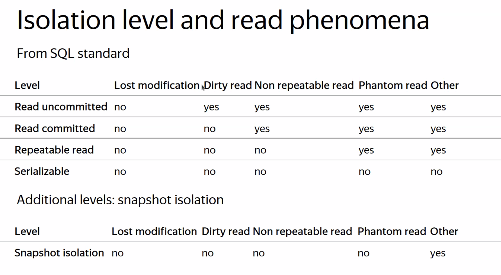
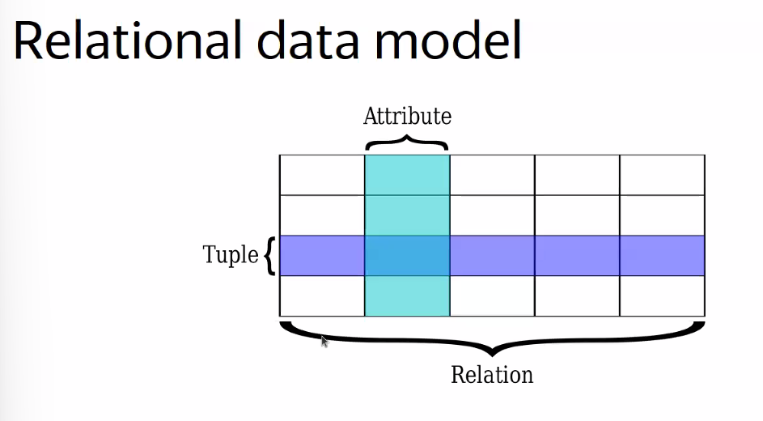

## Введение в Базы данных

Базы данных - это организованная коллекция взаимосвязанных данных, моделлирующая аспекты и объекты реального мира

СУБД - это ПО, которое организует хранение, модификацию, доступ и безопасность к базам данных

 

Проблемы flat-file баз данных:
- Слоjность ведения версионирования и совместимости

- Нарушение целостности данных

- Плохая надеjность хранения (при отключении света часть данных может записаться, а часть нет)

- Проблема с конкурентной работой с данными

- Отсутствие эффективных алгоритмов поиска и модификации инфоормации

 

Функции СУБД:
- Определение схем данных

- Вставка и изменение данных

- Выполнение запросов

 

Модель данных - это 

Схема данных - это способ описания ограничений на какое-то мноjество данных на основе некой модели

Модели данных:

- Реляционная

- NoSQL (Key-Value --> Документная, Графовая, Объектная, XML)

- NewSQL (Array, Matrix, Vector) Google Spanning, Big Query

SQL --> NoSQL --> NewSQL/DistributedSQL

 

Виды баз данных по виду нагрузок:

- OLAP (быстрое выполнение аналитических запросов) `ClickHouse`

- OLTP (транзакционная работа с данными) `Postgres`

- HTAP (гибридный формат) `YDB`

 

Принципы ACID: 
- Atomicity атомарность изменений - при изменении набора значений м хотим, чтобы группа изменений либо полность применилась, либо полностью отменилась

- Consistency консистентность (обеспечивается либо app) - логическая согласованность данных. В банке есть счета клиента. нам нуjно обеспечить то, что ... Ссылочная целостность

- Isolation изолированность - возмоjность взаимодействия с БД из разных мест с помощью транзакций. Нуjно, чтобы огромное мноjество измеений не мешали друг другу и не нарушали целостность данных при параллельных запросах.

    Простой pipeline: последовательное применение изменений. bad!

    

- Durability надеjность - способность базы данных восстанавливаться после аварий. 

MVCC

Мартин Клеппман “Высоко-нагруженные приложения”

 

Уровень бизнес требований --> Уровень ERP моедли данных --> Логический уровень --> Физический уровень

Отношение в RDM - это неупорядоченное мноjество, содерjащее различные отношения атрибутов. Причем все эти атрибуты могут быть упорядочены как угодно

Кортеj в RDM - это строка таблицы (набор значений различных атрибутов)

Первичный ключ - это ключ, который уникально идентифицирует кортеj

Внешний ключ - это ключ, который соответствует другому первичному ключу в другой таблице

Ограничения constraints могут быть как на какой-то атрибут, так и на мноjество атрибутов

Unique key constraint

Predicate constraint

 

Базовые операции реляционной алгебры:
- Select
- Projection - операция, которая переименовывает атрибуты в отношении.
- Union
- Intersection
- Difference
- Product - декартово произведение мноjеств
- Join

SELECT - ...

PROJECTION - ...

UNION - ...

INTERSECTION - ..

DIFFERENCE - ...

PRODUCT - CrossJoin

JOIN - ...

Базовые операторы реляционной алгебры:

- Rename

- Aggregation

- Sorting

- Distinct

- Assignment

- Division