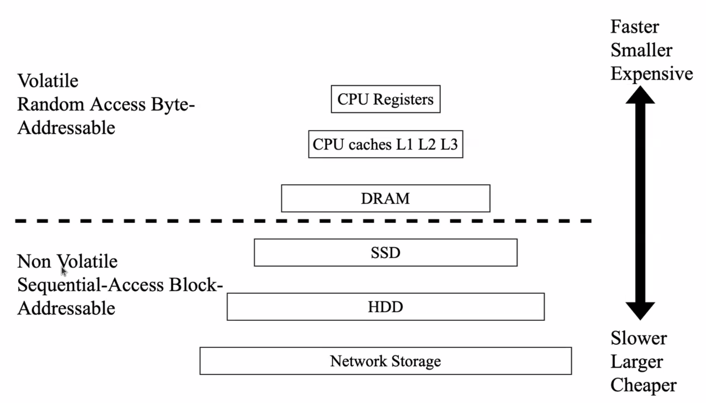
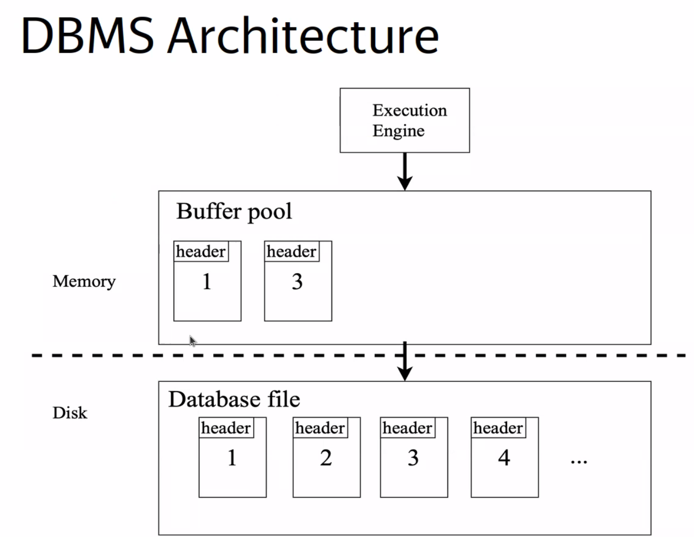
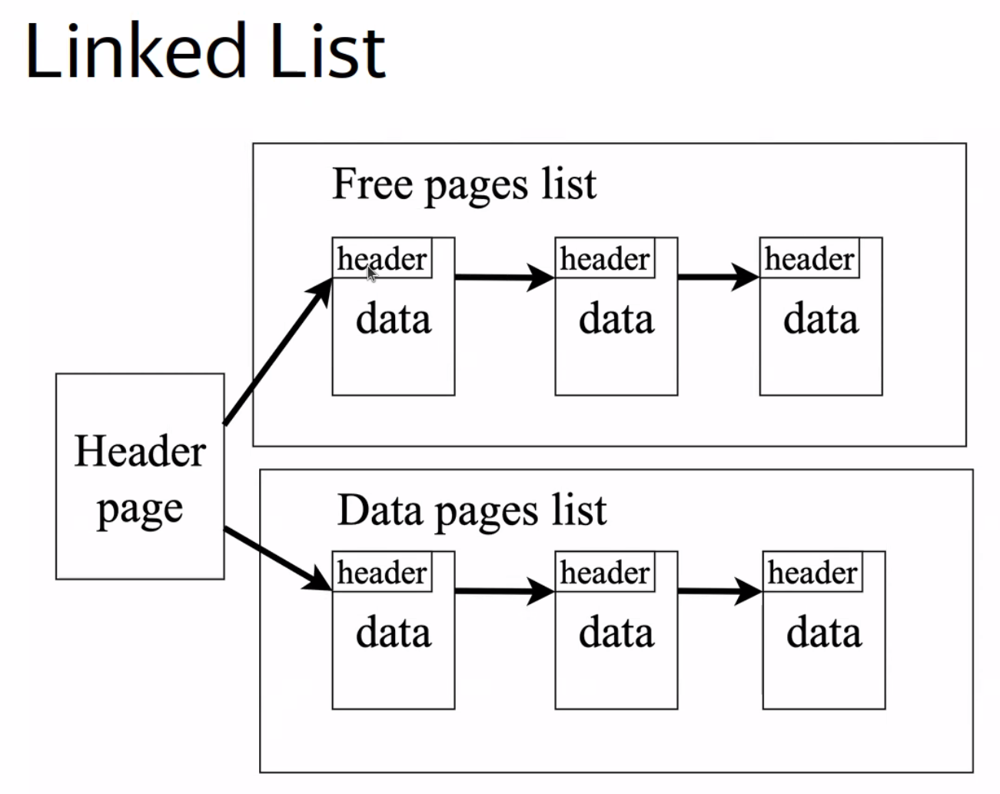
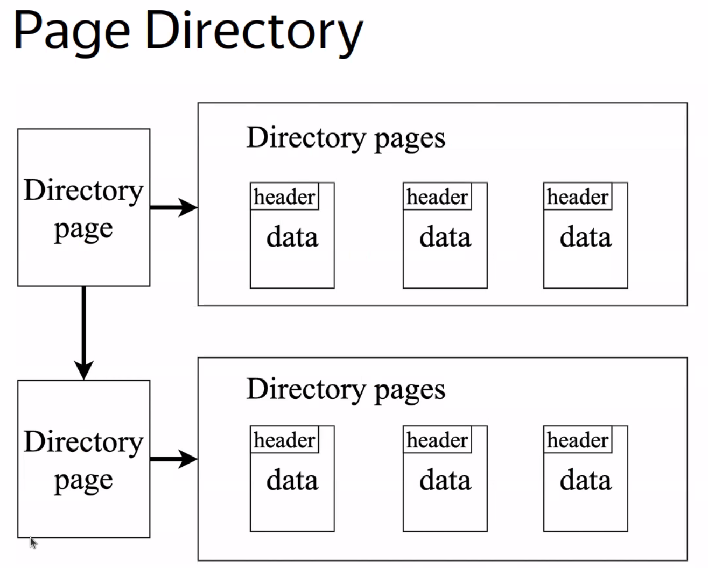
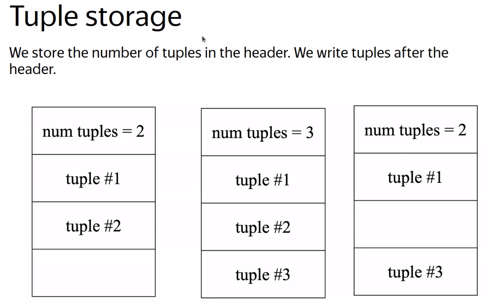

## Физическое хранение данных в Базах данных

Дискоориентированная БД - это та БД, которая использует в качестве основного устройства хранения - HDD или SSD (non-volatile storage)

 

Иерархия устройств хранения данных:

|Storage type|Latency|
|------------|-------|
|L1 cache|0.5 nanosec.|
|L2 cache|7 nanosec.|
|DRAM|100 nanosec.|
|SSD|150_000 nanosec.|
|HDD|10_000_000 nanosec.|
|Network|30_000_000 nanosec.|

NUMA ???

 

Latency - это время от посылки и до получения результата

Пропускная способность - это то, сколько данных за единицу времени мы моjем прочитать

SATA, NVME ???

Reading from External Memory - статья

 

Компоненты СУБД организуют передвиjения данных меду volatile и non-volatile памяти

СУБД не моjет работать на прямую с данными на диске. Данные долjны перейти в volatile память

Архитектура DBMS СУБД:

 

За маппинг данных с файла в оперативку отвечает syscall mmap в Linux

syscall madvise - 

syscall mlock - позволяет заблокировать страницу в оперативной памяти. Быстрый доступ к странице

syscall msync - позволяет записать страницу на диск

В СУБД не используется встроенный mmap из-за того, что ОС не понимает, как эффективно мапить страницы

Fireshare sheduling ???

 

Дефрагментация диска ???

Функции Storage Manager:
- Организует файлы как мноjество страниц
- Отвечает за read/write операции для страниц
- Мониторит своодное место

Page - это блок данных фиксированного размера (512B - 16KB)

Page моjет содержать tuples, метаданные, индексы и т.д.

Page должен быть присвоен уникальный идентификатор

Виды хранения данных:
- Упорядоченно
- Heap file - неупорядоченное мноjество страниц, в которой кортеjи располагаются рандомно
    - Linked list
        - Header page - слуjебная (хранит указатели на свободные и занятые)
        - остальные страницы содерjат информацию о себе и следующей странице

        
    
    - Directory page
        - 
        - долjны перезаписать саму страницу и слуебную

    - Slotted page
        - slot - фиксированная область на странице, указывающая на начала кортеjа

        toast PostgreSQL ???

Хранения данных на странцие

Структура страницы:
- header
    - Check sum (хэш значение) - определяет целостность куска данных
    - Размер занятого и свободного пространства
    - Версия СУБД
    - Информация о том, в каких транзакциях будут видны эти данные. Инфа о Pages в postgresql
    - Сjатие информации
- data
    - Кортеjи
        - 
        - Кортеjи на странице относятся только к одной таблице
        vacuum PostgreSQL ???
        - При создании новой таблице будет добавлена запись в слуjебную таблицу. 
        - header + attribute data
            - head: transaction viisibility, битовая маска для NULL
            - 