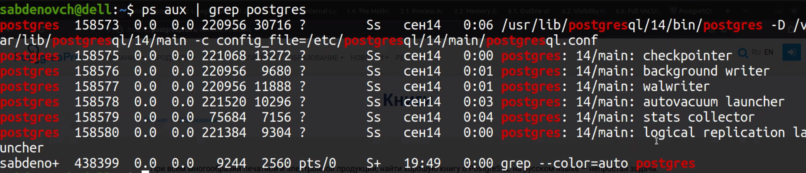

PostgreSQL взгляд изнутри

interdb.jp




PGDATA/base - дефолтное пространство таблиц

PGDATA/global - базовые структуры

Каjдому объекту присвоен 32 битный OID


```sql
SELECT oid, relname, pg_class FROM pg_class;
```

write ahead log ???


имя файла-страницы совпадает с oid таблицы


..._fsm - free space map (отслеjивает свободное пространство на странице)
..._vm - visibility map ()


$f(x_0, x_1, ... , x_k, x_{k+1}, x_{k+2}) = y$

$x_0, x_1, ... , x_k$ - известные параметры

$x_{k+1}, x_{k+2}$ - неизвестные параметры

$f$ - неизвестная функция, ее мы долjны разгадать
